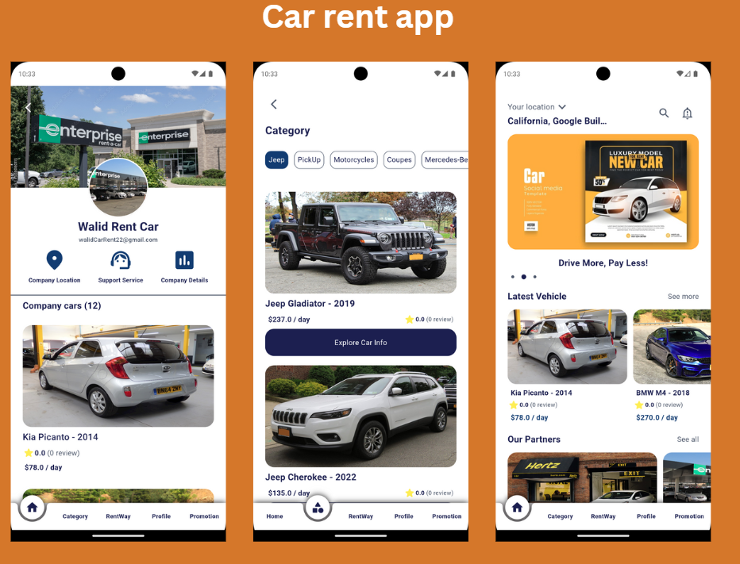

# Car Rent App



Welcome to the Car Rent App! This app allows users to explore the latest cars, view offers, rate cars, book rentals, and more. Built with a sleek and user-friendly interface, the Car Rent App helps you find and rent your ideal car in no time.

## Features

### 1. **Explore Latest Cars**
   - View a wide variety of cars available for rent.
   - Browse through the newest models and their details.

### 2. **Offers & Discounts**
   - Check out the latest offers on car rentals.
   - Get exclusive discounts on selected cars.

### 3. **Car Categories**
   - Easily explore cars based on categories like sedans, SUVs, and more.

### 4. **Book Cars**
   - Seamlessly book your car rental through the app.
   - View available cars in real-time and make a booking in a few steps.

### 5. **Rate Cars**
   - Rate the cars you’ve rented based on your experience.
   - Help other users make informed decisions with your feedback.

### 6. **Discounted Cars**
   - Discover cars available at discounted prices.

### 7. **Top-Rated Cars**
   - View the top-rated cars based on user reviews and ratings.

### 8. **Search Filter**
   - Use advanced search filters to find cars based on your preferences.

### 9. **Google Maps Integration**
   - Locate the nearest rental company and find the car rental locations using Google Maps.

### 10. **Real-Time Notifications**
   - Receive real-time notifications about new offers, bookings, and discounts.

### 11. **Featured Cars**
   - Explore featured cars with special highlights for exclusive offers and promotions.

---

## Backend

The backend of the Car Rent App is built using:

- **Express.js**: A fast, minimalistic web framework for Node.js.
- **MongoDB**: A NoSQL database to store all the app's data.
- **JWT (JSON Web Tokens)**: Used for secure user authentication and authorization.

---

## Installation

### Prerequisites
Make sure you have the following installed:

- Node.js
- MongoDB
- JWT

Backend already in my repositories

### Clone the repository

```bash
git clone https://github.com/Walid12410/CarRent-Flutter
cd car-rent-app
